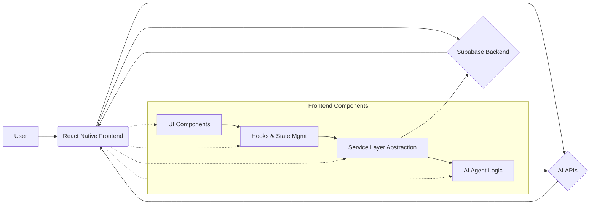

# System Patterns: QuestLog

## 1. Architecture Overview
QuestLog appears to follow a standard client-server architecture pattern, common for modern web/mobile applications:
*   **Frontend:** React Native / Expo application handling UI rendering, state management, and user interactions.
*   **Backend:** Supabase providing database services, authentication, and potentially serverless functions (though not explicitly confirmed yet).
*   **External Services:** AI APIs (DeepSeek, Gemini) for chat responses, analysis, and suggestions.



## 2. Key Technical Decisions & Patterns
*   **Cross-Platform Development:** Using React Native and Expo allows targeting multiple platforms (iOS, Android, Web) from a single codebase.
*   **Component-Based UI:** Leveraging React's component model for building the user interface. Specific UI libraries like `react-native-paper` are used.
*   **State Management:**
    *   Local component state (`useState`).
    *   Shared state via React Context API (`ThemeContext`, `SuggestionContext`, `ChatContext`). `ChatContext` provides a single instance of chat state (`messages`) and functions (`sendMessage`, `triggerWelcomeMessage`, etc.) managed by `useChatData` hook, ensuring consistency across components like `TaskList` and `ChatInterface`.
    *   Custom Hooks (`useJournal`, `useAuth`, `useTheme`, `useSuggestions`, `useChat`) encapsulate related state logic and side effects, promoting reusability and separation of concerns. `useChat` consumes `ChatContext`.
*   **Data Fetching & Services:** A dedicated service layer (`services/`) abstracts interactions with the backend (Supabase) and potentially external APIs. This keeps data logic separate from UI components.
*   **AI Integration:** An "Agent" pattern (`services/agents/`) is used to encapsulate logic related to interacting with different AI models (DeepSeek, Gemini) for specific tasks (chat, suggestions, analysis).
*   **Asynchronous Operations:** Extensive use of `async/await` for handling asynchronous tasks like API calls and database operations. Error handling (`try/catch`) is present but needs detailed review for consistency and robustness.
*   **Routing:** `expo-router` is used for navigation within the application.
*   **Styling:** Combination of global styles (`styles/global.js`) and feature-specific styles (`journalStyles.ts`, `questStyles.ts`). Theming is supported via `ThemeContext`.

## 3. Component Relationships (Focus on Journal Feature)
*   **`JournalPanel.tsx` (UI):** Displays journal entries, input fields, AI responses. Uses `useJournal` hook for data and actions, `useSuggestions` for triggering analysis, `useAuth` for user ID, `useTheme` for styling. Interacts with `journalService` indirectly via hooks or directly for specific actions like checking daily entry status. Calls `router.push` for navigation.
*   **`useJournal.ts` (Hook):** Manages state related to the journal (current date, entries, AI responses, loading/error states). Provides functions to interact with `journalService` (e.g., `saveCurrentCheckup`, fetching entries). Handles local state updates (`updateLocalEntryText`).
*   **`journalService.ts` (Service):** Contains functions for direct interaction with the Supabase backend (or equivalent data store) for CRUD operations on journal entries (checkups, daily entries).
*   **`ChatAgent.ts` (Agent):** Handles chat interactions. Generates automatic checkup entries after a chat session using `generateCheckupContent` and saves them via `journalService.saveCheckupEntry`. Fetches past checkups via `journalService` for context.
*   **`SuggestionContext.tsx` / `SuggestionAgent.ts` (Context/Agent):** Manages suggestion logic. `analyzeJournalEntry` function (likely within `SuggestionAgent` and exposed via context) is called from `JournalPanel.tsx` after saving a checkup to trigger AI analysis/feedback.
*   **`CheckupItem.tsx` / `AIResponse.tsx` (UI):** Child components used by `JournalPanel.tsx` to render individual checkups and AI feedback.

## 4. Critical Implementation Paths (Journal Feature)
*   **Manual Checkup:** `JournalPanel` (Input) -> `handleSaveCheckup` -> `useJournal.saveCurrentCheckup` -> `journalService.saveCheckupEntry` (fetches context, calls `JournalAgent.generateResponse` which emits `ANALYZE_JOURNAL_ENTRY` event, saves checkup+response to DB) -> `useSuggestions.analyzeJournalEntry` (called after save, seems redundant).
*   **Automatic Checkup:** `ChatAgent.summarizeAndStoreSession` -> `generateCheckupContent` (uses LLM) -> `journalService.saveCheckupEntry` (fetches context, calls `JournalAgent.generateResponse` which emits `ANALYZE_JOURNAL_ENTRY` event, saves checkup+response to DB).
*   **Daily Entry:** `JournalPanel` (Button) -> `handleDailyEntry` -> (potentially `useJournal.saveCurrentCheckup` for final text) -> `journalService.saveDailyEntry` (fetches all checkups, formats content, calls `JournalAgent.processEndOfDay` for EOD response & analysis, saves daily entry to DB, updates checkups to link them) -> `router.push('/journal')`. The daily analysis is displayed within `app/journal.tsx` by fetching the `JournalEntry` object.

## 5. Potential Areas for Review
*   Consistency in error handling across UI, hooks, services, and agents.
*   Management of loading states, especially during concurrent operations.
*   Potential race conditions between saving checkup entries and triggering suggestion analysis (event emitted *before* DB save in service, direct call happens *after*).
*   Data flow and state synchronization between `useJournal`, `JournalPanel`, and `journalService`.
*   Robustness of the daily entry generation, specifically the final step of linking checkups via DB update after the main entry is saved.
*   Apparent redundancy in triggering suggestion analysis for manual checkups (event emission + direct call).

## Key Agents and Services

- **JournalAgent**: Responsible for generating AI insights for journal entries and checkup entries.
- **SuggestionAgent**: Generates task and quest suggestions from checkup content and provides functionality to find the best quest for a task, check for duplicates, and more.
- **UpdateAgent**: Detects and applies task status updates (InProgress, Done) based on checkup content analysis.
- **ChatAgent**: Handles conversation analysis and message generation for the chat interface. Also involved in summarizing chat sessions for automatic checkup creation.
- **WelcomeAgent**: Generates the initial welcome message and conversation starter for new users (detected by having zero tasks).

## System Flows

### Checkup Processing Flow

1. User creates a checkup entry in the journal
2. The checkup is saved to the database via `journalService.saveCheckupEntry()`
3. After saving, the `journalService` concurrently triggers:
   - **SuggestionAgent**: Analyzes the checkup to generate task/quest suggestions
   - **UpdateAgent**: Analyzes the checkup to detect task status updates

```
User Input (Checkup) → journalService.saveCheckupEntry()
                      ↓
        ┌─────────────────────────┐
        │                         │
        ↓                         ↓
SuggestionAgent.analyzeCheckup    UpdateAgent.processCheckup
(Task/Quest Suggestions)          (Task Status Updates)
        │                         │
        ↓                         ↓
globalSuggestionStore             Database Update
(User Review)                     (Immediate)
```

### Suggestion Flow

1. `SuggestionAgent.analyzeCheckupForSuggestions()` processes checkup content
2. Generates both new quest suggestions (with associated tasks) and standalone task suggestions
3. Processes standalone tasks through duplicate/continuation detection
4. All suggestions are added to `globalSuggestionStore` for user review
5. When user accepts a suggestion, it's saved to the database

### Task Status Update Flow

1. `UpdateAgent.processCheckupForStatusUpdates()` analyzes checkup content
2. Detects if the user indicates they've started or completed a task
3. If high-confidence detection (>0.88), updates the task status directly
4. Changes are applied immediately without requiring user confirmation

### New User Welcome Message Flow

1.  `TaskList.tsx` component mounts and uses `useTasks` and `useChat` hooks.
2.  `useTasks` finishes loading (`loading` becomes false).
3.  An `useEffect` hook in `TaskList.tsx` checks if `tasks.length === 0`, `messages.length === 0` (from `useChat`), and a session flag (`welcomeMessageSentThisSession`) is false.
4.  If all conditions are met, it calls `triggerWelcomeMessage()` obtained from the shared `ChatContext` via the `useChat` hook.
5.  The `triggerWelcomeMessage` function (defined in `useChatData` and provided by `ChatContext`) calls `WelcomeAgent.generateWelcomeMessage()`.
6.  `WelcomeAgent` uses a specific prompt and the user's personality to generate a welcome message via the LLM (DeepSeek).
7.  The response strings are returned to the `triggerWelcomeMessage` function in `useChatData`.
8.  `triggerWelcomeMessage` updates the shared `messages` state within `useChatData` (managed by the single instance within `ChatProvider`) using its standard mechanism (including typing indicator and stagger delay).
9.  The `useEffect` in `TaskList.tsx` sets the `welcomeMessageSentThisSession` flag to true.
10. `ChatInterface` (rendered via `DesktopLayout`), consuming the same `ChatContext` via `useChat`, receives the updated `messages` state and displays the new welcome message.

```mermaid
graph TD
    A[TaskList Mounts] --> B{useTasks Loading};
    B -- Data Loaded --> C{Tasks.length === 0?};
    C -- Yes --> C1{Messages.length === 0?};
    C -- No --> Z[End Flow];
    C1 -- No --> Z;
    C1 -- Yes --> D{Session Flag False?};
    D -- No --> Z;
    D -- Yes --> E[Call triggerWelcomeMessage() via useChat];
    E --> F[ChatContext];
    F --> G[useChatData Instance];
    G --> H[WelcomeAgent.generateWelcomeMessage];
    H --> I{LLM (DeepSeek)};
    I --> H;
    H --> G;
    G -- Response --> F;
    F -- Updates Shared State --> L[Shared Messages State];
    L --> M[ChatInterface via useChat];
    M --> N[Render Welcome Message];
    E --> K[Set Session Flag True];
```
